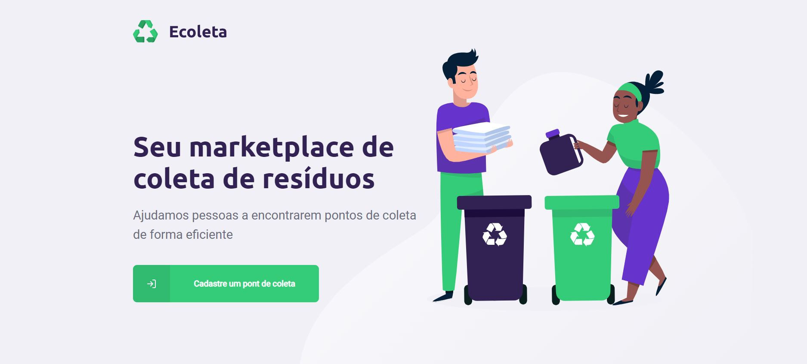

<h1 align="center">
    MovieList
</h1>

  <a href="#-tecnologias">Tecnologias</a>&nbsp;&nbsp;&nbsp;|&nbsp;&nbsp;&nbsp;
  <a href="#-projeto">Projeto</a>&nbsp;&nbsp;&nbsp;|&nbsp;&nbsp;&nbsp;
  <a href="#-como-usar">Como Usar</a>&nbsp;&nbsp;&nbsp;|&nbsp;&nbsp;&nbsp;
  <a href="#-como-contribuir">Como contribuir</a>

  

## 🚀 Tecnologias

Esse projeto foi desenvolvido com as seguintes tecnologias:

- [ReactJs](https://reactjs.org/)
- [Node.js](https://nodejs.org/)
- [Express](https://expressjs.com/)
- [SQlite](https://www.sqlite.org/index.html)
- [knex](http://knexjs.org/)
- JavaScript
- HTML5
- CSS

## 💻 Projeto

Esta aplicação foi desenvolvida durante a Next Level Week promovida pela [Rocketseat](https://rocketseat.com.br/). Durante essa semana os participantes puderam desenvolver uma aplicação para cadastro de pontos de coleta. O backend foi desenvovlvido com o [Node.js](https://nodejs.org/) e [SQlite](https://www.sqlite.org/index.html), o frontend foi desenvolvido com [ReactJS](https://reactjs.org/)

## 🔥 Como usar

- É necessário ter o [Node.js](https://nodejs.org/en/) e [npm](https://www.npmjs.com/) instalados
- Clone esse repositório: `git clone https://github.com/romaSilva/MovieList-React.git`
  
### Backend
- Instale as dependências do projeto, digitando no terminal: `npm install`
- Crie o banco de dados: `npm run knex:migrate` e `npm run knex::seed`
- Inicie a API: `npm run dev`

### Frontend

- Instale as dependências do projeto, digitando no termintal: `npm install`
- Enfim, para rodar a aplicação digite: `npm start`
​

## ♻️ Como contribuir

- Faça um fork desse repositório;
- Cria uma branch com a sua feature: `git checkout -b minha-feature`;
- Faça commit das suas alterações: `git commit -m 'feat: Minha nova feature'`;
- Faça push para a sua branch: `git push origin minha-feature`.

Depois que o merge da sua pull request for feito, você pode deletar a sua branch.